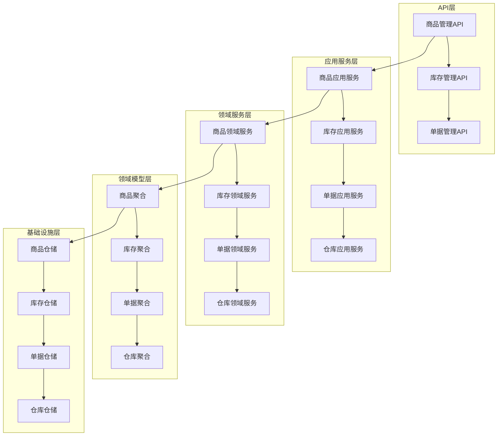

# 商品库存联动管理系统设计文档

## 概述

本文档详细设计了商品库存联动管理系统的技术架构和实现方案。系统采用领域驱动设计（DDD）架构，实现商品与库存的深度集成，支持完整的库存单据流程和多仓库管理。

## 架构设计

### 系统架构图



### 核心组件设计

#### 1. 商品管理组件
- **商品聚合根**: 管理SPU/SKU的完整生命周期
- **商品领域服务**: 处理商品业务逻辑
- **商品事件发布**: 发布商品变更事件

#### 2. 库存管理组件
- **库存聚合根**: 管理库存数量和状态
- **库存领域服务**: 处理库存业务逻辑
- **库存事件处理**: 响应商品变更事件

#### 3. 单据管理组件
- **单据聚合根**: 管理各类库存单据
- **单据工厂**: 创建不同类型的单据
- **单据状态机**: 管理单据状态流转

#### 4. 仓库管理组件
- **仓库聚合根**: 管理仓库信息
- **多仓库策略**: 处理多仓库库存分配
- **调拨管理**: 处理仓库间调拨

## 组件和接口

### 商品管理接口

```java
// 商品管理API接口
@RestController
@RequestMapping("/api/products")
public class ProductController {
    
    @PostMapping
    public ProductResponse createProduct(@RequestBody CreateProductRequest request);
    
    @PutMapping("/{spuId}")
    public ProductResponse updateProduct(@PathVariable String spuId, 
                                       @RequestBody UpdateProductRequest request);
    
    @DeleteMapping("/{spuId}")
    public void deleteProduct(@PathVariable String spuId);
    
    @GetMapping("/{spuId}")
    public ProductResponse getProduct(@PathVariable String spuId);
}

// 商品应用服务接口
public interface ProductApplicationService {
    ProductSpu createProduct(CreateProductCommand command);
    ProductSpu updateProduct(String spuId, UpdateProductCommand command);
    void deleteProduct(String spuId);
    ProductSpu getProduct(String spuId);
}
```

### 库存管理接口

```java
// 库存管理API接口
@RestController
@RequestMapping("/api/inventory")
public class InventoryController {
    
    @GetMapping("/sku/{skuId}")
    public InventoryResponse getInventory(@PathVariable String skuId);
    
    @PostMapping("/reserve")
    public void reserveInventory(@RequestBody ReserveInventoryRequest request);
    
    @PostMapping("/release")
    public void releaseInventory(@RequestBody ReleaseInventoryRequest request);
    
    @GetMapping("/warehouse/{warehouseId}")
    public List<InventoryResponse> getWarehouseInventory(@PathVariable String warehouseId);
}

// 库存应用服务接口
public interface InventoryApplicationService {
    Inventory getInventory(String skuId, String warehouseId);
    void reserveInventory(String skuId, String warehouseId, Integer quantity, String orderId);
    void releaseInventory(String skuId, String warehouseId, Integer quantity, String orderId);
    void confirmInventory(String skuId, String warehouseId, Integer quantity, String orderId);
}
```

### 单据管理接口

```java
// 单据管理API接口
@RestController
@RequestMapping("/api/stock-documents")
public class StockDocumentController {
    
    @PostMapping("/inbound")
    public StockDocumentResponse createInboundDocument(@RequestBody CreateInboundDocumentRequest request);
    
    @PostMapping("/outbound")
    public StockDocumentResponse createOutboundDocument(@RequestBody CreateOutboundDocumentRequest request);
    
    @PostMapping("/transfer")
    public StockDocumentResponse createTransferDocument(@RequestBody CreateTransferDocumentRequest request);
    
    @PostMapping("/{documentId}/approve")
    public void approveDocument(@PathVariable String documentId);
    
    @PostMapping("/{documentId}/execute")
    public void executeDocument(@PathVariable String documentId);
}

// 单据应用服务接口
public interface StockDocumentApplicationService {
    StockDocument createInboundDocument(CreateInboundDocumentCommand command);
    StockDocument createOutboundDocument(CreateOutboundDocumentCommand command);
    StockDocument createTransferDocument(CreateTransferDocumentCommand command);
    void approveDocument(String documentId, String approverId);
    void executeDocument(String documentId);
}
```

## 数据模型

### 商品数据模型

```java
// 商品SPU聚合根
@Entity
@Table(name = "product_spu")
public class ProductSpu extends AggregateRoot {
    private String spuId;           // SPU ID
    private String spuName;         // SPU名称
    private String description;     // 商品描述
    private String categoryId;      // 分类ID
    private ProductStatus status;   // 商品状态
    private List<ProductSku> skus;  // SKU列表
    
    // 商品创建
    public static ProductSpu create(CreateProductCommand command) {
        // 创建商品逻辑
        // 发布商品创建事件
    }
    
    // 商品更新
    public void update(UpdateProductCommand command) {
        // 更新商品逻辑
        // 发布商品更新事件
    }
    
    // 商品删除
    public void delete() {
        // 删除前验证
        // 发布商品删除事件
    }
}

// 商品SKU实体
@Entity
@Table(name = "product_sku")
public class ProductSku extends BaseEntity {
    private String skuId;           // SKU ID
    private String spuId;           // 所属SPU ID
    private String skuName;         // SKU名称
    private BigDecimal price;       // 价格
    private String specifications;  // 规格信息
    private Integer initialQuantity; // 初始库存
}
```

### 库存数据模型

```java
// 库存聚合根
@Entity
@Table(name = "inventory")
public class Inventory extends AggregateRoot {
    private String skuId;              // SKU ID
    private String warehouseId;        // 仓库ID
    private Integer availableQuantity; // 可用库存
    private Integer reservedQuantity;  // 预留库存
    private Integer occupiedQuantity;  // 占用库存
    private BigDecimal unitCost;       // 单位成本
    
    // 库存预留
    public void reserve(Integer quantity, String orderId) {
        // 验证可用库存
        // 执行预留操作
        // 发布库存预留事件
    }
    
    // 库存释放
    public void release(Integer quantity, String orderId) {
        // 验证预留库存
        // 执行释放操作
        // 发布库存释放事件
    }
    
    // 库存确认
    public void confirm(Integer quantity, String orderId) {
        // 预留转占用
        // 发布库存确认事件
    }
}

// 库存批次实体
@Entity
@Table(name = "inventory_batch")
public class InventoryBatch extends BaseEntity {
    private String batchNo;         // 批次号
    private String skuId;           // SKU ID
    private String warehouseId;     // 仓库ID
    private Integer quantity;       // 批次数量
    private LocalDate productionDate; // 生产日期
    private LocalDate expiryDate;   // 过期日期
    private BigDecimal unitCost;    // 批次成本
}
```

### 单据数据模型

```java
// 库存单据聚合根
@Entity
@Table(name = "stock_document")
public class StockDocument extends AggregateRoot {
    private String documentId;      // 单据ID
    private String documentNo;      // 单据编号
    private DocumentType type;      // 单据类型
    private DocumentStatus status;  // 单据状态
    private String warehouseId;     // 仓库ID
    private String operatorId;      // 操作人ID
    private LocalDateTime createTime; // 创建时间
    private List<StockDocumentItem> items; // 单据明细
    
    // 单据审核
    public void approve(String approverId) {
        // 验证单据状态
        // 执行审核逻辑
        // 发布单据审核事件
    }
    
    // 单据执行
    public void execute() {
        // 验证单据状态
        // 执行库存变更
        // 发布单据执行事件
    }
}

// 单据明细实体
@Entity
@Table(name = "stock_document_item")
public class StockDocumentItem extends BaseEntity {
    private String documentId;      // 单据ID
    private String skuId;           // SKU ID
    private Integer quantity;       // 数量
    private BigDecimal unitPrice;   // 单价
    private String batchNo;         // 批次号
    private String remark;          // 备注
}

// 单据类型枚举
public enum DocumentType {
    INBOUND_PURCHASE,    // 采购入库
    INBOUND_PRODUCTION,  // 生产入库
    INBOUND_RETURN,      // 退货入库
    OUTBOUND_SALE,       // 销售出库
    OUTBOUND_PRODUCTION, // 生产出库
    OUTBOUND_TRANSFER,   // 调拨出库
    TRANSFER,            // 仓库调拨
    ADJUSTMENT           // 库存调整
}

// 单据状态枚举
public enum DocumentStatus {
    DRAFT,      // 草稿
    PENDING,    // 待审核
    APPROVED,   // 已审核
    EXECUTED,   // 已执行
    CANCELLED   // 已取消
}
```

### 仓库数据模型

```java
// 仓库聚合根
@Entity
@Table(name = "warehouse")
public class Warehouse extends AggregateRoot {
    private String warehouseId;     // 仓库ID
    private String warehouseName;   // 仓库名称
    private String warehouseCode;   // 仓库编码
    private String address;         // 仓库地址
    private String managerId;       // 仓库管理员
    private WarehouseStatus status; // 仓库状态
    
    // 仓库激活
    public void activate() {
        this.status = WarehouseStatus.ACTIVE;
        // 发布仓库激活事件
    }
    
    // 仓库停用
    public void deactivate() {
        // 验证仓库是否有库存
        this.status = WarehouseStatus.INACTIVE;
        // 发布仓库停用事件
    }
}
```

## 正确性属性

*属性是一个特征或行为，应该在系统的所有有效执行中保持为真——本质上是关于系统应该做什么的正式声明。属性作为人类可读规范和机器可验证正确性保证之间的桥梁。*

### 属性 1: 商品创建时库存记录自动生成
*对于任何* 新创建的商品，系统应该为每个SKU自动创建对应的库存记录，确保商品与库存数据的一致性
**验证需求: 1.1**

### 属性 2: 商品删除时库存数据安全清理
*对于任何* 被删除的商品，系统应该验证库存状态并安全删除相关库存数据，不留下孤立的库存记录
**验证需求: 1.2**

### 属性 3: 商品信息变更时库存同步更新
*对于任何* 商品SKU信息的修改，系统应该同步更新库存记录中的商品信息，保持数据一致性
**验证需求: 1.3**

### 属性 4: 单据类型创建的完整性
*对于任何* 库存单据的创建请求，系统应该支持所有定义的单据类型并正确创建相应的单据记录
**验证需求: 2.1, 2.2**

### 属性 5: 单据执行后库存变更的正确性
*对于任何* 审核通过的库存单据，执行后应该按照单据明细正确更新库存数量
**验证需求: 2.4**

### 属性 6: 库存预留和释放的原子性
*对于任何* 库存预留或释放操作，系统应该保证操作的原子性，避免库存数据不一致
**验证需求: 7.1, 7.2**

### 属性 7: 多仓库库存查询的准确性
*对于任何* 库存查询请求，系统应该返回准确的仓库库存信息，包括可用、预留、占用库存
**验证需求: 3.1, 10.1**

## 错误处理

### 商品管理错误处理

```java
public class ProductErrorHandler {
    
    // 商品不存在异常
    @ExceptionHandler(ProductNotFoundException.class)
    public ResponseEntity<ErrorResponse> handleProductNotFound(ProductNotFoundException ex) {
        return ResponseEntity.status(HttpStatus.NOT_FOUND)
            .body(new ErrorResponse("PRODUCT_NOT_FOUND", ex.getMessage()));
    }
    
    // 商品状态异常
    @ExceptionHandler(InvalidProductStatusException.class)
    public ResponseEntity<ErrorResponse> handleInvalidProductStatus(InvalidProductStatusException ex) {
        return ResponseEntity.status(HttpStatus.BAD_REQUEST)
            .body(new ErrorResponse("INVALID_PRODUCT_STATUS", ex.getMessage()));
    }
    
    // 商品删除异常
    @ExceptionHandler(ProductDeletionException.class)
    public ResponseEntity<ErrorResponse> handleProductDeletion(ProductDeletionException ex) {
        return ResponseEntity.status(HttpStatus.CONFLICT)
            .body(new ErrorResponse("PRODUCT_DELETION_FAILED", ex.getMessage()));
    }
}
```

### 库存管理错误处理

```java
public class InventoryErrorHandler {
    
    // 库存不足异常
    @ExceptionHandler(InsufficientInventoryException.class)
    public ResponseEntity<ErrorResponse> handleInsufficientInventory(InsufficientInventoryException ex) {
        return ResponseEntity.status(HttpStatus.BAD_REQUEST)
            .body(new ErrorResponse("INSUFFICIENT_INVENTORY", ex.getMessage()));
    }
    
    // 库存预留异常
    @ExceptionHandler(InventoryReservationException.class)
    public ResponseEntity<ErrorResponse> handleInventoryReservation(InventoryReservationException ex) {
        return ResponseEntity.status(HttpStatus.CONFLICT)
            .body(new ErrorResponse("INVENTORY_RESERVATION_FAILED", ex.getMessage()));
    }
    
    // 仓库不存在异常
    @ExceptionHandler(WarehouseNotFoundException.class)
    public ResponseEntity<ErrorResponse> handleWarehouseNotFound(WarehouseNotFoundException ex) {
        return ResponseEntity.status(HttpStatus.NOT_FOUND)
            .body(new ErrorResponse("WAREHOUSE_NOT_FOUND", ex.getMessage()));
    }
}
```

### 单据管理错误处理

```java
public class StockDocumentErrorHandler {
    
    // 单据状态异常
    @ExceptionHandler(InvalidDocumentStatusException.class)
    public ResponseEntity<ErrorResponse> handleInvalidDocumentStatus(InvalidDocumentStatusException ex) {
        return ResponseEntity.status(HttpStatus.BAD_REQUEST)
            .body(new ErrorResponse("INVALID_DOCUMENT_STATUS", ex.getMessage()));
    }
    
    // 单据审核异常
    @ExceptionHandler(DocumentApprovalException.class)
    public ResponseEntity<ErrorResponse> handleDocumentApproval(DocumentApprovalException ex) {
        return ResponseEntity.status(HttpStatus.FORBIDDEN)
            .body(new ErrorResponse("DOCUMENT_APPROVAL_FAILED", ex.getMessage()));
    }
    
    // 单据执行异常
    @ExceptionHandler(DocumentExecutionException.class)
    public ResponseEntity<ErrorResponse> handleDocumentExecution(DocumentExecutionException ex) {
        return ResponseEntity.status(HttpStatus.INTERNAL_SERVER_ERROR)
            .body(new ErrorResponse("DOCUMENT_EXECUTION_FAILED", ex.getMessage()));
    }
}
```

## 测试策略

### 单元测试策略

**商品管理单元测试**:
- 商品创建、更新、删除的业务逻辑测试
- 商品状态流转的测试
- 商品事件发布的测试

**库存管理单元测试**:
- 库存预留、释放、确认的逻辑测试
- 库存计算的准确性测试
- 库存事件处理的测试

**单据管理单元测试**:
- 单据创建、审核、执行的流程测试
- 单据状态机的测试
- 单据明细的验证测试

### 属性测试策略

系统将使用 **JUnit 5** 和 **jqwik** 进行属性测试，每个属性测试运行最少100次迭代以确保充分的随机性验证。

**属性测试配置**:
- 测试框架: JUnit 5 + jqwik
- 最小迭代次数: 100次
- 每个正确性属性对应一个独立的属性测试方法
- 使用注释标记属性测试与设计文档的对应关系

**属性测试示例**:

```java
class ProductInventoryPropertyTest {
    
    /**
     * Feature: enhanced-product-management, Property 1: 商品创建时库存记录自动生成
     */
    @Property
    void productCreationShouldGenerateInventoryRecords(@ForAll CreateProductCommand command) {
        // 创建商品
        ProductSpu product = productService.createProduct(command);
        
        // 验证每个SKU都有对应的库存记录
        for (ProductSku sku : product.getSkus()) {
            Inventory inventory = inventoryService.getInventory(sku.getSkuId(), DEFAULT_WAREHOUSE_ID);
            assertThat(inventory).isNotNull();
            assertThat(inventory.getSkuId()).isEqualTo(sku.getSkuId());
        }
    }
    
    /**
     * Feature: enhanced-product-management, Property 5: 单据执行后库存变更的正确性
     */
    @Property
    void documentExecutionShouldUpdateInventoryCorrectly(@ForAll StockDocument document) {
        // 记录执行前的库存
        Map<String, Integer> beforeInventory = getInventorySnapshot(document);
        
        // 执行单据
        stockDocumentService.executeDocument(document.getDocumentId());
        
        // 验证库存变更的正确性
        for (StockDocumentItem item : document.getItems()) {
            Inventory inventory = inventoryService.getInventory(item.getSkuId(), document.getWarehouseId());
            int expectedChange = calculateExpectedChange(document.getType(), item.getQuantity());
            int actualChange = inventory.getAvailableQuantity() - beforeInventory.get(item.getSkuId());
            assertThat(actualChange).isEqualTo(expectedChange);
        }
    }
}
```

### 集成测试策略

**商品库存集成测试**:
- 商品创建到库存生成的端到端测试
- 商品删除时库存清理的集成测试
- 商品更新时库存同步的集成测试

**单据流程集成测试**:
- 完整的单据审批流程测试
- 单据执行后库存变更的集成测试
- 多仓库调拨的端到端测试

**系统集成测试**:
- 订单系统与库存系统的集成测试
- 采购系统与库存系统的集成测试
- 数据一致性的集成测试