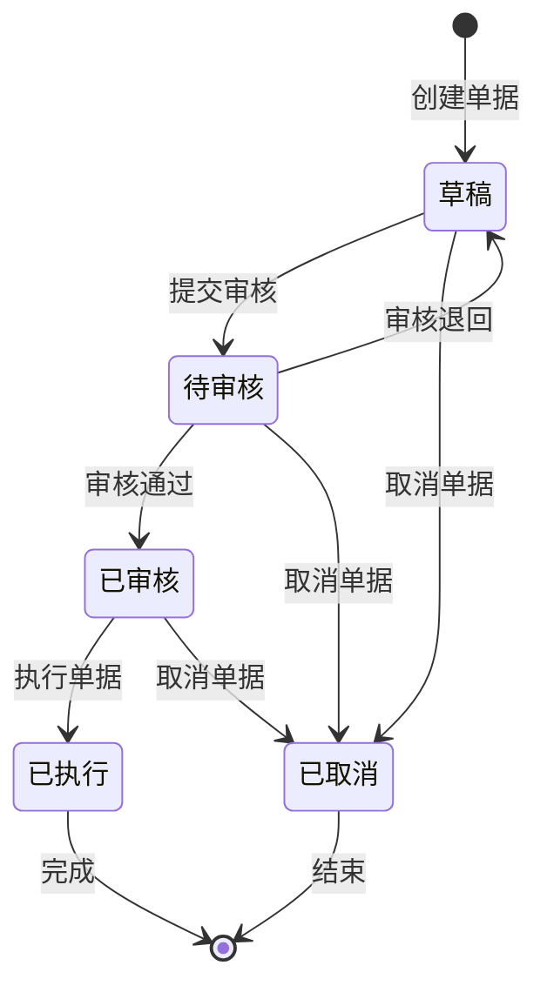
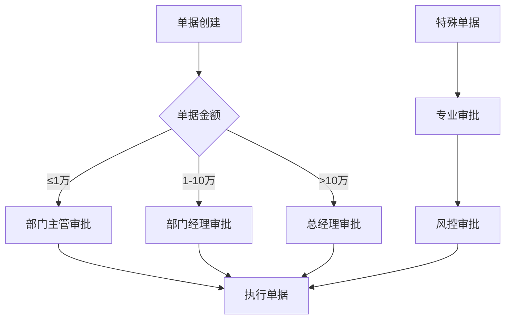

# 库存单据体系产品文档

## 概述

库存单据体系是商品库存联动管理系统的核心组成部分，负责管理所有库存变动的标准化流程。通过统一的单据管理，确保库存操作的可追溯性、准确性和合规性。

## 单据分类体系

### 1. 入库单据类型

#### 1.1 采购入库单 (INBOUND_PURCHASE)
**业务场景**: 供应商供货入库
**触发条件**: 采购订单到货验收
**业务流程**:
```
采购订单 → 到货通知 → 质检验收 → 创建采购入库单 → 审核 → 执行入库 → 更新库存
```

**单据字段**:
- 采购订单号
- 供应商信息
- 到货日期
- 质检结果
- 入库明细（SKU、数量、批次、成本）

**业务规则**:
- 入库数量不能超过采购订单剩余数量
- 必须通过质检才能入库
- 自动计算加权平均成本

#### 1.2 生产入库单 (INBOUND_PRODUCTION)
**业务场景**: 生产完工产品入库
**触发条件**: 生产任务完成
**业务流程**:
```
生产计划 → 生产执行 → 完工报告 → 创建生产入库单 → 审核 → 执行入库 → 更新库存
```

**单据字段**:
- 生产订单号
- 生产线信息
- 完工日期
- 质量等级
- 入库明细（成品SKU、数量、批次）

**业务规则**:
- 入库数量不能超过生产计划数量
- 自动扣减原材料库存
- 按生产成本计算入库成本

#### 1.3 退货入库单 (INBOUND_RETURN)
**业务场景**: 客户退货商品入库
**触发条件**: 退货申请审核通过
**业务流程**:
```
退货申请 → 退货审核 → 商品回收 → 质检评估 → 创建退货入库单 → 审核 → 执行入库
```

**单据字段**:
- 原销售订单号
- 退货原因
- 退货日期
- 商品状态评估
- 入库明细（SKU、数量、状态）

**业务规则**:
- 退货商品需要质检评估
- 根据商品状态决定入库类型（正品/次品）
- 按原销售价格计算退货成本

#### 1.4 其他入库单 (INBOUND_OTHER)
**业务场景**: 盘盈、调拨入库等其他入库
**触发条件**: 特殊业务需求
**业务流程**:
```
业务需求 → 申请审批 → 创建其他入库单 → 审核 → 执行入库 → 更新库存
```

### 2. 出库单据类型

#### 2.1 销售出库单 (OUTBOUND_SALE)
**业务场景**: 销售订单商品出库
**触发条件**: 销售订单支付完成
**业务流程**:
```
销售订单 → 库存预留 → 拣货指令 → 创建销售出库单 → 审核 → 执行出库 → 发货
```

**单据字段**:
- 销售订单号
- 客户信息
- 发货地址
- 物流信息
- 出库明细（SKU、数量、批次）

**业务规则**:
- 优先出库临期商品（FIFO原则）
- 自动释放预留库存
- 按加权平均成本计算出库成本

#### 2.2 生产出库单 (OUTBOUND_PRODUCTION)
**业务场景**: 生产领料出库
**触发条件**: 生产计划下达
**业务流程**:
```
生产计划 → BOM展算 → 领料申请 → 创建生产出库单 → 审核 → 执行出库 → 生产投料
```

**单据字段**:
- 生产订单号
- BOM版本
- 领料部门
- 用料日期
- 出库明细（原料SKU、数量、批次）

**业务规则**:
- 按BOM清单自动计算用料数量
- 支持超领和补领
- 按实际用料成本计算

#### 2.3 调拨出库单 (OUTBOUND_TRANSFER)
**业务场景**: 仓库间调拨出库
**触发条件**: 调拨申请审批
**业务流程**:
```
调拨申请 → 审批通过 → 创建调拨出库单 → 审核 → 执行出库 → 在途管理 → 调拨入库
```

**单据字段**:
- 调拨申请单号
- 调出仓库
- 调入仓库
- 调拨原因
- 出库明细（SKU、数量、批次）

**业务规则**:
- 调出仓库库存充足
- 自动生成对应的调拨入库单
- 保持批次信息不变

#### 2.4 其他出库单 (OUTBOUND_OTHER)
**业务场景**: 盘亏、报损、赠送等其他出库
**触发条件**: 特殊业务需求
**业务流程**:
```
业务需求 → 申请审批 → 创建其他出库单 → 审核 → 执行出库 → 更新库存
```

### 3. 调拨单据类型

#### 3.1 仓库调拨单 (TRANSFER)
**业务场景**: 仓库间库存调拨
**触发条件**: 库存平衡需求
**业务流程**:
```
库存分析 → 调拨计划 → 创建调拨单 → 审核 → 执行调拨 → 在途跟踪 → 完成确认
```

**单据字段**:
- 调拨计划号
- 调出仓库
- 调入仓库
- 运输方式
- 调拨明细（SKU、数量、批次）

**业务规则**:
- 同时创建调拨出库单和调拨入库单
- 支持在途库存管理
- 保持成本信息不变

### 4. 调整单据类型

#### 4.1 库存调整单 (ADJUSTMENT)
**业务场景**: 盘点差异调整、报损报溢
**触发条件**: 盘点结果、异常处理
**业务流程**:
```
盘点/异常 → 差异分析 → 原因调查 → 创建调整单 → 审核 → 执行调整 → 更新库存
```

**单据字段**:
- 调整原因
- 调整类型（盘盈/盘亏/报损/报溢）
- 责任部门
- 调整明细（SKU、调整数量、原因说明）

**业务规则**:
- 需要详细的调整原因说明
- 大额调整需要特殊审批
- 自动计算调整金额

## 单据状态流转

### 状态定义



### 状态说明

| 状态 | 说明 | 可执行操作 |
|------|------|------------|
| 草稿 (DRAFT) | 单据创建但未提交 | 编辑、提交、取消 |
| 待审核 (PENDING) | 单据已提交等待审核 | 审核、退回、取消 |
| 已审核 (APPROVED) | 单据审核通过等待执行 | 执行、取消 |
| 已执行 (EXECUTED) | 单据已执行完成 | 查看、打印 |
| 已取消 (CANCELLED) | 单据已取消 | 查看 |

### 状态流转规则

1. **草稿 → 待审核**
   - 单据信息完整
   - 明细数据有效
   - 库存数量充足（出库单据）

2. **待审核 → 已审核**
   - 具有审核权限
   - 业务规则验证通过
   - 相关资源可用

3. **已审核 → 已执行**
   - 库存状态正常
   - 系统资源可用
   - 执行条件满足

4. **任意状态 → 已取消**
   - 具有取消权限
   - 未执行的单据
   - 业务允许取消

## 单据审批流程

### 审批层级设计



### 审批规则配置

#### 1. 按金额分级审批
- **≤1万元**: 部门主管审批
- **1-10万元**: 部门经理审批  
- **>10万元**: 总经理审批

#### 2. 按单据类型审批
- **采购入库**: 采购部门 → 财务部门
- **生产出库**: 生产部门 → 仓库部门
- **调拨单据**: 仓库部门 → 运营部门
- **调整单据**: 仓库部门 → 财务部门

#### 3. 特殊审批流程
- **大额调整**: 需要总经理特批
- **跨区域调拨**: 需要区域经理审批
- **报损单据**: 需要质量部门审批

### 审批权限管理

```java
// 审批权限配置
@Configuration
public class ApprovalConfig {
    
    // 按角色配置审批权限
    public Map<String, ApprovalAuthority> getApprovalAuthorities() {
        Map<String, ApprovalAuthority> authorities = new HashMap<>();
        
        // 部门主管权限
        authorities.put("DEPT_SUPERVISOR", ApprovalAuthority.builder()
            .maxAmount(new BigDecimal("10000"))
            .documentTypes(Arrays.asList(DocumentType.INBOUND_PURCHASE, DocumentType.OUTBOUND_SALE))
            .build());
            
        // 部门经理权限
        authorities.put("DEPT_MANAGER", ApprovalAuthority.builder()
            .maxAmount(new BigDecimal("100000"))
            .documentTypes(Arrays.asList(DocumentType.values()))
            .build());
            
        // 总经理权限
        authorities.put("GENERAL_MANAGER", ApprovalAuthority.builder()
            .maxAmount(BigDecimal.valueOf(Long.MAX_VALUE))
            .documentTypes(Arrays.asList(DocumentType.values()))
            .build());
            
        return authorities;
    }
}
```

## 单据编号规则

### 编号格式设计

```
单据编号格式: {单据类型}{仓库代码}{日期}{流水号}
示例: PI-WH01-20241215-0001
```

### 编号规则说明

| 组成部分 | 说明 | 示例 |
|----------|------|------|
| 单据类型 | 2位字母代码 | PI(采购入库)、SO(销售出库) |
| 仓库代码 | 4位仓库编码 | WH01、WH02 |
| 日期 | 8位日期YYYYMMDD | 20241215 |
| 流水号 | 4位递增序号 | 0001、0002 |

### 单据类型代码

| 单据类型 | 代码 | 说明 |
|----------|------|------|
| 采购入库 | PI | Purchase Inbound |
| 生产入库 | MI | Manufacturing Inbound |
| 退货入库 | RI | Return Inbound |
| 其他入库 | OI | Other Inbound |
| 销售出库 | SO | Sale Outbound |
| 生产出库 | MO | Manufacturing Outbound |
| 调拨出库 | TO | Transfer Outbound |
| 其他出库 | OO | Other Outbound |
| 仓库调拨 | TR | Transfer |
| 库存调整 | AD | Adjustment |

## 单据打印模板

### 入库单打印模板

```
┌─────────────────────────────────────────────────────────────┐
│                        采购入库单                           │
├─────────────────────────────────────────────────────────────┤
│ 单据编号: PI-WH01-20241215-0001    │ 入库日期: 2024-12-15   │
│ 供应商: 北京供应商有限公司          │ 采购订单: PO202412001   │
│ 仓库: 北京仓库                     │ 经办人: 张三           │
├─────────────────────────────────────────────────────────────┤
│ 序号 │ 商品编码 │ 商品名称 │ 规格 │ 数量 │ 单价 │ 金额   │
├─────────────────────────────────────────────────────────────┤
│  1   │ SKU001   │ 商品A   │ 500g │ 100  │ 10.0 │ 1000.0 │
│  2   │ SKU002   │ 商品B   │ 1kg  │  50  │ 20.0 │ 1000.0 │
├─────────────────────────────────────────────────────────────┤
│ 合计数量: 150                      │ 合计金额: 2000.0       │
├─────────────────────────────────────────────────────────────┤
│ 制单人: 李四    │ 审核人: 王五    │ 仓管员: 赵六         │
│ 制单时间: 2024-12-15 10:00        │ 审核时间: 2024-12-15 11:00 │
└─────────────────────────────────────────────────────────────┘
```

### 出库单打印模板

```
┌─────────────────────────────────────────────────────────────┐
│                        销售出库单                           │
├─────────────────────────────────────────────────────────────┤
│ 单据编号: SO-WH01-20241215-0001    │ 出库日期: 2024-12-15   │
│ 客户: 北京客户有限公司             │ 销售订单: SO202412001   │
│ 仓库: 北京仓库                     │ 经办人: 张三           │
├─────────────────────────────────────────────────────────────┤
│ 序号 │ 商品编码 │ 商品名称 │ 规格 │ 数量 │ 批次号 │ 备注   │
├─────────────────────────────────────────────────────────────┤
│  1   │ SKU001   │ 商品A   │ 500g │  50  │ B001   │        │
│  2   │ SKU002   │ 商品B   │ 1kg  │  30  │ B002   │        │
├─────────────────────────────────────────────────────────────┤
│ 合计数量: 80                                               │
├─────────────────────────────────────────────────────────────┤
│ 制单人: 李四    │ 审核人: 王五    │ 拣货员: 赵六         │
│ 制单时间: 2024-12-15 14:00        │ 审核时间: 2024-12-15 15:00 │
└─────────────────────────────────────────────────────────────┘
```

## 单据查询和报表

### 单据查询功能

#### 1. 基础查询条件
- 单据编号
- 单据类型
- 单据状态
- 创建日期范围
- 仓库
- 操作人

#### 2. 高级查询条件
- 商品SKU
- 供应商/客户
- 金额范围
- 审核人
- 执行状态

#### 3. 查询结果展示
- 列表视图：显示单据基本信息
- 详情视图：显示单据完整信息
- 统计视图：显示汇总统计数据

### 单据统计报表

#### 1. 单据汇总报表
- 按类型统计单据数量
- 按状态统计单据分布
- 按时间统计单据趋势

#### 2. 库存变动报表
- 入库汇总报表
- 出库汇总报表
- 库存变动明细报表

#### 3. 业务分析报表
- 供应商入库分析
- 客户出库分析
- 仓库作业效率分析

## 系统集成接口

### 与采购系统集成

```java
// 采购入库接口
@RestController
@RequestMapping("/api/integration/purchase")
public class PurchaseIntegrationController {
    
    // 接收采购到货通知
    @PostMapping("/arrival-notice")
    public ResponseEntity<String> receiveArrivalNotice(@RequestBody ArrivalNoticeRequest request) {
        // 创建采购入库单
        CreateInboundDocumentCommand command = buildInboundCommand(request);
        StockDocument document = stockDocumentService.createInboundDocument(command);
        return ResponseEntity.ok(document.getDocumentId());
    }
    
    // 反馈入库结果
    @PostMapping("/inbound-result")
    public ResponseEntity<Void> feedbackInboundResult(@RequestBody InboundResultRequest request) {
        // 更新采购订单状态
        purchaseOrderService.updateInboundStatus(request.getPurchaseOrderId(), request.getInboundQuantity());
        return ResponseEntity.ok().build();
    }
}
```

### 与销售系统集成

```java
// 销售出库接口
@RestController
@RequestMapping("/api/integration/sales")
public class SalesIntegrationController {
    
    // 接收销售订单
    @PostMapping("/sales-order")
    public ResponseEntity<String> receiveSalesOrder(@RequestBody SalesOrderRequest request) {
        // 预留库存
        inventoryService.reserveInventory(request.getItems());
        
        // 创建销售出库单
        CreateOutboundDocumentCommand command = buildOutboundCommand(request);
        StockDocument document = stockDocumentService.createOutboundDocument(command);
        return ResponseEntity.ok(document.getDocumentId());
    }
    
    // 查询库存可用性
    @GetMapping("/inventory-availability")
    public ResponseEntity<InventoryAvailabilityResponse> checkInventoryAvailability(@RequestParam String skuId, @RequestParam Integer quantity) {
        boolean available = inventoryService.checkAvailability(skuId, quantity);
        return ResponseEntity.ok(new InventoryAvailabilityResponse(available));
    }
}
```

### 与财务系统集成

```java
// 财务集成接口
@RestController
@RequestMapping("/api/integration/finance")
public class FinanceIntegrationController {
    
    // 推送库存成本数据
    @PostMapping("/inventory-cost")
    public ResponseEntity<Void> pushInventoryCost(@RequestBody InventoryCostRequest request) {
        // 计算库存成本
        InventoryCostData costData = inventoryService.calculateInventoryCost(request.getSkuId(), request.getWarehouseId());
        
        // 推送到财务系统
        financeService.updateInventoryCost(costData);
        return ResponseEntity.ok().build();
    }
    
    // 获取库存价值报表
    @GetMapping("/inventory-value-report")
    public ResponseEntity<InventoryValueReport> getInventoryValueReport(@RequestParam String warehouseId, @RequestParam LocalDate reportDate) {
        InventoryValueReport report = inventoryService.generateValueReport(warehouseId, reportDate);
        return ResponseEntity.ok(report);
    }
}
```

## 移动端支持

### 移动端功能设计

#### 1. 扫码入库
- 扫描商品条码
- 输入入库数量
- 选择批次信息
- 提交入库申请

#### 2. 扫码出库
- 扫描拣货单二维码
- 扫描商品条码确认
- 输入实际出库数量
- 完成出库操作

#### 3. 移动盘点
- 扫描盘点任务二维码
- 扫描商品条码
- 输入实际库存数量
- 提交盘点结果

### 移动端API设计

```java
// 移动端API接口
@RestController
@RequestMapping("/api/mobile")
public class MobileApiController {
    
    // 扫码获取商品信息
    @GetMapping("/product/{barcode}")
    public ResponseEntity<ProductInfo> getProductByBarcode(@PathVariable String barcode) {
        ProductInfo product = productService.getProductByBarcode(barcode);
        return ResponseEntity.ok(product);
    }
    
    // 移动端入库
    @PostMapping("/inbound")
    public ResponseEntity<String> mobileInbound(@RequestBody MobileInboundRequest request) {
        // 验证用户权限
        // 创建入库单
        // 返回单据编号
    }
    
    // 移动端出库
    @PostMapping("/outbound")
    public ResponseEntity<String> mobileOutbound(@RequestBody MobileOutboundRequest request) {
        // 验证拣货单
        // 执行出库操作
        // 返回操作结果
    }
}
```

## 性能优化策略

### 1. 数据库优化
- 单据表按月分表
- 明细表建立复合索引
- 历史数据定期归档

### 2. 缓存策略
- 单据状态缓存
- 审批流程缓存
- 库存数据缓存

### 3. 异步处理
- 单据执行异步化
- 库存计算异步化
- 报表生成异步化

### 4. 批量操作
- 批量创建单据
- 批量审核单据
- 批量执行单据

这个库存单据体系为商品库存联动管理提供了完整的业务流程支撑，确保了库存操作的标准化、规范化和可追溯性。